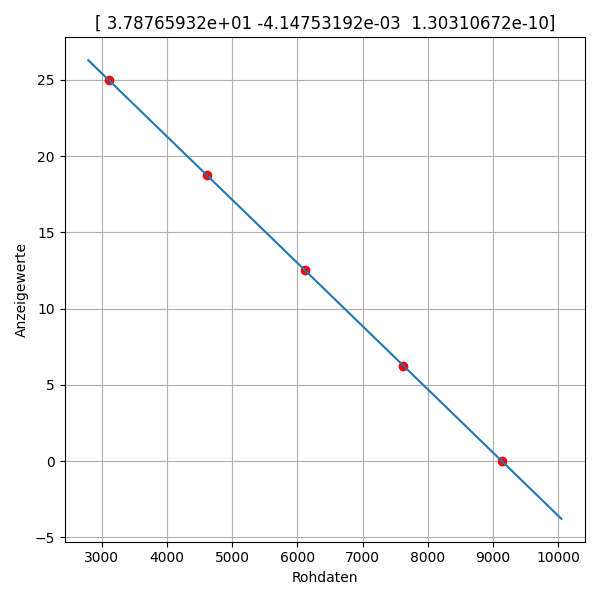

[back to Index](Index.md)

# Curve Fitting

Curve fitting is one of the tasks, where tiny helper scripts are really useful.  
Let's try that.

In my case, it's ADC raw data, that needs to be converted to some useful units in a GUI.

So, the arrays *Rohdaten* and *Anzeigewerte* contain measured values, if applying a signal to the ADC's input.

I want to do a polynom fitting, that means finding the coefficients of a polynomial popt(X) of degree k
that fits the data Y best in a least-squares sense. Just as matlabs polyfit() would do.

X is in the example *Rohdaten*, and Y is *Anzeigewerte*, because i take an existing matlab code and try to do similar stuff in Python.

I don't know at the beginning which degree of polynom i need. I usually begin with k = 2 (2nd order), but that depends on the actual data set.

**SciPy.optimize** module contains a function [curve_fit()](https://docs.scipy.org/doc/scipy/reference/generated/scipy.optimize.curve_fit.html):
* Syntax: *curve_fit(f, xdata, ydata, p0=None, ...)*
    * f  - The model function, f(x, …); x is first arg, separate args follow
    * p0 - an array with initial guess

I will use that function in the script.




```
import matplotlib.pyplot as plt
from numpy import linspace
from scipy.optimize import curve_fit

plt.figure(figsize = (6, 6))


Rohdaten     = [ 9135, 7627, 6120, 4612,  3105 ] # ADC bits
Anzeigewerte = [ 0,    6.25, 12.5, 18.75, 25   ] # displayed data


# Geben Sie den Grad k des anzupassenden Polynoms ein:
#   1-lineares Fitting         p0 + p1*x
#   2-quadratisches Fitting    p0 + p1*x + p2*x^2
#   3-kubisches Fitting        p0 + p1*x + p2*x^2 + p3*x^3

k = 2

if k == 1:
    def PolyFit(x,p0,p1):
        return p0 + p1*x
    p0 = [0, 1]
elif k == 2:
    def PolyFit(x,p0,p1,p2):
        return p0 + p1*x + p2*x**2
    p0 = [0, 1, 0]
elif k == 3:
    def PolyFit(x,p0,p1,p2,p3):
        return p0 + p1*x + p2*x**2 + p3*x**3
    p0 = [0, 1, 0, 0]
elif k == 4:
    def PolyFit(x,p0,p1,p2,p3,p4):
        return p0 + p1*x + p2*x**2 + p3*x**3 + p4*x**4
    p0 = [0, 1, 0, 0, 0]


# curve_fit(f, xdata, ydata, p0=None, \
#           sigma=None, absolute_sigma=False, \
#           check_finite=None, bounds=(-inf, inf), \
#           method=None, jac=None, *, full_output=False, \
#           nan_policy=None, **kwargs)
#   f  - The model function, f(x, …).
#        x is first arg, separate args follow
#   p0 - array_like, optional: initial guess

popt, pcov = curve_fit(PolyFit, Rohdaten, Anzeigewerte, p0) 


x = linspace(0.9*min(Rohdaten),1.1*max(Rohdaten),250)

if k == 1:
    y = PolyFit(x,popt[0],popt[1])
elif k == 2:
    y = PolyFit(x,popt[0],popt[1],popt[2])
elif k == 3:
    y = PolyFit(x,popt[0],popt[1],popt[2],popt[3])
elif k == 4:
    y = PolyFit(x,popt[0],popt[1],popt[2],popt[3],popt[4])

print(popt)

plt.plot(Rohdaten, Anzeigewerte, 'ro')
plt.plot(x,y)
plt.grid()
plt.xlabel('Rohdaten')
plt.ylabel('Anzeigewerte')
plt.title(str(popt))

plt.tight_layout()
plt.show()
```

[back to Index](Index.md)
