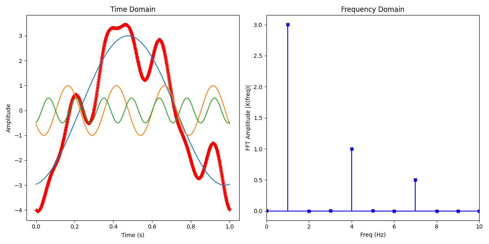

[back to Index](Index.md)

# Fast Fourier Transform

One of math use cases in advanced Electronic Engineering is the *Fast Fourier Transformation*.  
The basic idea behind is, that we have an math algorithm, with translates a signal from time domain into an equivalent in frequency domain.

Actually, we are not working on the signal itself, but rather on a number of samples of the original signal in equidistant points in time and convert it to a series of frequency samples. Or, vice versa, convert frequency samples into time domain. 

**Fast Fourier Transform** is an algorithm, which implements a *Discrete Fourier Transform* (DFT), and the inverse is called *Inverse Discrete Fourier Transform* (IDFT). So don't be confused by the different terms.

You may have seen this in practice on a *vector network analyzer*, which is able to do present signals also in time domain, or a on a *spectrum analyzer*. May be your *oscilloscope* provides this function as an software add-on to present the spectra of an periodic signal.

Naturally, all of this works on *complex numbers*. If you're not yet familar with *complex numbers*, you should start by reading on those first and come back later.

# A first example
Let's construct a time domain signal from three frequencies:
* 1Hz with amplitude 3.0 and phase 30°
* 4Hz with amplitude 1.0 and phase 10°
* 7Hz with amplitude 0.5 and phase 5°

This boils down to...

*f(t) = 3.0 \* sin(2\*pi\*1.0\*t + 30°\*(pi/180°)) + 1.0 \* sin(2\*pi\*4.0\*t + 10°\*(pi/180°)) + 0.5 \* sin(2\*pi\*7.0\*t + 5°\*(pi/180°))*

**And then, try to run a FFT on this sum signal.**



```
import matplotlib.pyplot as plt
from numpy import sin,pi,linspace,arange,abs
from numpy.fft import fft, ifft

plt.figure(figsize = (12, 6))

sr = 2048                  # sampling rate in time domain
t = linspace(0.0, 1.0, sr) # time vector

def SinusSignal(A, f, phs, t):
    return A * sin(2*pi*f*t + phs)


def TestSignal(t):
    return ( SinusSignal(3.0, 1.0, 30, t) +
             SinusSignal(1.0, 4.0, 10, t) +
             SinusSignal(0.5, 7.0,  5, t) )

x = TestSignal(t)


# doing the fft
X = fft(x)
N = len(X)
n = arange(N)
T = N/sr
freq = n/T
A = (2. / sr)

plt.subplot(121)
plt.plot(t, ifft(X), 'r+') # same as plt.plot(t, TestSignal(t))
plt.plot(t, SinusSignal(3.0, 1.0, 30, t))
plt.plot(t, SinusSignal(1.0, 4.0, 10, t))
plt.plot(t, SinusSignal(0.5, 7.0,  5, t))
plt.xlabel('Time (s)')
plt.ylabel('Amplitude')
plt.title('Time Domain')


plt.subplot(122)
plt.stem(freq, A * abs(X),
         'b', markerfmt="X", basefmt="-b")
plt.xlim(0, 10)
plt.xlabel('Freq (Hz)')
plt.ylabel('FFT Amplitude |X(freq)|')
plt.title('Frequency Domain')

plt.tight_layout()
plt.show()
```


[back to Index](Index.md)
