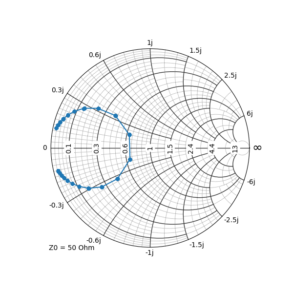

[back to index](Index.md)

# Importing Matlab data
Matlab files come in different file formats. Depending on the file format, the data was saved, different methods needs to be choosen.

| Option   | Supported Features                           | Python support |
| -------- | -------------------------------------------- | -------------- |
| '-v7.3'  | v7 + data items >= 2GB on 64-bit systems.    | h5py, mat73    |
| '-v7'    | v6 + plus data compression and Unicode       | SciPy.io       |
| '-v6'    | v4 + N-dimensional arrays, cell and structure arrays, and variable names greater than 19 characters | SciPy.io       |
| '-v4'    | 2D - double, character, and sparse arrays    | SciPy.io       |


> [!NOTE]
> Converting Matlab .mat files may be done by opening and saving in Matlab itself:
```
clear
load('test.mat')
save('test.mat', '-v7')
```

# Helpful libs
* for math **SciPy**: pip install scipy
* for reading v7.3 files **h5py**: pip install h5py
* for reading v7.3 files **mat73**: pip install mat73
* for extended plots **plotly**: pip install plotly==5.18.0


In SciPy, these functions help to import or export matlab data.
* **loadmat()**
* **savemat()**

Example:

```
import scipy.io
import mat73
import numpy as np
import sys
sys.path.append("./pySmithPlot-master")
from matplotlib import rcParams, pyplot as pp
from smithplot import SmithAxes


# NOTE: '/' instead of '\\'
folder = "Z:/_Unix/scripts_und_sourcecode/matlab/20200311_test_guncal"
fname = folder + "/" + "GUN_Calibration_20200311_123946.mat"

try:
    # v4, v5, v6, v7
    # for 7.3 files, exception NotImplementedError is raised
    mat_dict = scipy.io.loadmat(fname)
except NotImplementedError:
    # v7.3; may be installed with 'pip install mat73'
    mat_dict = mat73.loadmat(fname)

print(mat_dict.keys())


# 420x1 complex double
z = np.array(mat_dict["z"]).reshape(420)

rcParams.update({"legend.numpoints": 3})
pp.figure(figsize=(6, 6))
ax = pp.subplot(1, 1, 1, projection='smith')
pp.plot(z, label="detuning", datatype=SmithAxes.S_PARAMETER)
pp.show()
```



[back to index](Index.md)
