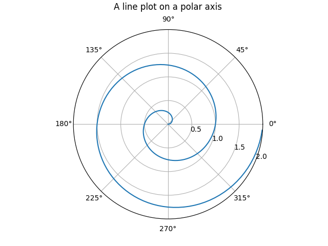

[back to index](../README.md)

# Matplotlib

The python matplotlib seems to be inspired by matlab, there are many similarities.

The main differences are, that most things work on the matplotlib.pyplot class instance,
whereas matlab uses mainly functions.

Also, the plot needs as the last command pyplot.show() to present anything to the user.

## Basic plots

```
import matplotlib.pyplot as plt

plt.subplot(121)
plt.plot(x, y, 'r+')
plt.xlabel('Time (s)')
plt.ylabel('Amplitude')
plt.title('Time Domain')
plt.xlim(0, 10)
plt.show()
```

## Polar Plots


```
import matplotlib.pyplot as plt
import numpy as np

r = np.arange(0, 2, 0.01)
theta = 2 * np.pi * r

fig, ax = plt.subplots(subplot_kw={'projection': 'polar'})
ax.plot(theta, r)
ax.set_rmax(2)
ax.set_rticks([0.5, 1, 1.5, 2])  # Less radial ticks
ax.set_rlabel_position(-22.5)  # Move radial labels away from plotted line
ax.grid(True)

ax.set_title("A line plot on a polar axis", va='bottom')
plt.show()
```

## Plotting Smith Charts

Smith charts can be done using the [pySmithPlot](https://github.com/vMeijin/pySmithPlot) library, which registers a new projection type in Matplotlib.  
However, this library doesn't seem to be maintained any longer, so i use [my own fork with fixes to this lib](https://github.com/wirbel-at-vdr-portal/pySmithPlot).


```
pp.figure(figsize=(6, 6))
ax = pp.subplot(1, 1, 1, projection='smith')
pp.plot(z, label="detuning", datatype=SmithAxes.S_PARAMETER)
pp.show()
```


[back to index](../README.md)
