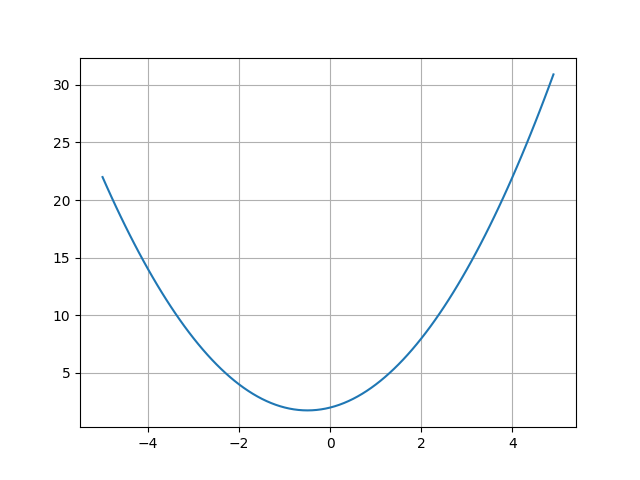
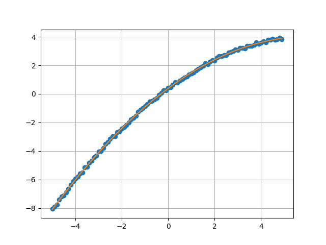

[back to Index](Index.md)

# Optimizers

Optimizers are a set of procedures in SciPy that either find the minimum value of a function, or the root of an equation, ie polynoms.

Let's plot the function *f(x) = x + cos(x)*.
> [!NOTE]
> This example requires the matplotlib, which may be installed with [pip install matplotlib](../pip.md).
```
import matplotlib.pyplot as plt
import numpy as np
from math import cos

xpoints = np.array(list(range(-50,50))) * 0.1 
ypoints = np.array(list(map(lambda x : x + cos(x), list(xpoints))))

plt.plot(xpoints, ypoints)
plt.grid()
plt.show()
```


## *optimize.root()* - Find the roots of a function
Now, let's find the roots of the function *f(x) = x + cos(x)* using **optimize.root()**.

> [!NOTE]
> A root of a function F(x) is a number x, such that F(x)=0.

* [Syntax: *root\(fun, x0\[, args, method, jac, tol, ...\]\)*](https://docs.scipy.org/doc/scipy/reference/generated/scipy.optimize.root.html#scipy.optimize.root)
* *fun* - a vector function to find a root of.
* *x0* - initial guess for x.

```
from math import cos
from scipy import optimize

def myfunc(x):
    return x + cos(x)

zeros = optimize.root(myfunc, 0)

print(zeros.x)
# [-0.73908513]

print(zeros)
# message: The solution converged.
# success: True
#  status: 1
#     fun: [ 0.000e+00]
#       x: [-7.391e-01]
#    nfev: 9
#    fjac: [[-1.000e+00]]
#       r: [-1.674e+00]
#     qtf: [-2.668e-13]
```
The returned object *zeros* contains the result in it's member x.

## *optimize.minimize()* - Find the minima of a function
Let's try to find the minima of the function *f(x) = x^2 + x + 2* using **optimize.minimize()**.


* [Syntax: *scipy.optimize.minimize(fun, x0, args=(), method=None, jac=None, hess=None, hessp=None, bounds=None, constraints=(), tol=None, callback=None, options=None)*](https://docs.scipy.org/doc/scipy/reference/generated/scipy.optimize.minimize.html#scipy.optimize.minimize)
* *fun* - The function, fun = f(x, \*args) -> float.  
  **It must take *x* as the first arg** and may use additional params.
* *x0* - initial guess
* *args* - opt: arguments for fun
* *method* - opt: one of
    * Nelder-Mead
    * Powell
    * CG
    * BFGS
    * Newton-CG
    * L-BFGS-B
    * TNC
    * COBYLA
    * SLSQP
    * trust-constr
    * dogleg
    * trust-ncg
    * trust-exact
    * trust-krylov

```
from scipy.optimize import minimize

def fun(x):
    return x**2 + x + 2

minima = minimize(fun, 0, method='BFGS')
print(minima.x)
#[-0.50000001]

print(minima)
#  message: Optimization terminated successfully.
#  success: True
#   status: 0
#      fun: 1.75
#        x: [-5.000e-01]
#      nit: 2
#      jac: [ 0.000e+00]
# hess_inv: [[ 5.000e-01]]
#     nfev: 8
#     njev: 4
```

## *optimize.curve_fit()* - Fitting data
Here, we try to fit data from an [.csv file](./data/example2.csv), to get a second order poly.  
The data relates to x=(-5.0, +5.0, 0.1) and was created with popt = \[ 0.3  1.2 -0.1\] plus some randomness.

* [Syntax: *scipy.optimize.curve_fit(f, xdata, ydata, p0=None, sigma=None, absolute_sigma=False, check_finite=None, bounds=(-inf, inf), method=None, jac=None, \*, full_output=False, nan_policy=None, \*\*kwargs)*](https://docs.scipy.org/doc/scipy/reference/generated/scipy.optimize.curve_fit.html#scipy.optimize.curve_fit)
* *f* - The model function, f(x, …).  
  **It must take *x* as the first arg** and the params to fit as separate remaining arguments.
* *xdata* - the independent variable, x, where the data points y are measured
* *ydata* - the dependent data, y, same size as x

```
import numpy as np
from scipy.optimize import curve_fit
import matplotlib.pyplot as plt
import csv

# xpoints = -5.0 ... +5.0
xpoints = np.array(list(range(-50,50))) * 0.1

# read data from a .csv file
ydata = []
with open('data/example2.csv',newline='') as csvfile:
    for row in csv.reader(csvfile, delimiter=','):
        for s in row:
            try:
                ydata.append(float(s))
            except:
                pass

def poly2(x,p0,p1,p2):
    return  p0 + x*p1 + x**2*p2

popt, pcov = curve_fit(poly2, xpoints, ydata)
print(popt)
# [ 0.39000073  1.20031115 -0.09919223]

# using the coeffs estimated by curve_fit, create a fitted plot.
yfit = []
for x in xpoints:
    yfit.append(poly2(x,popt[0],popt[1],popt[2]))

plt.plot(xpoints,ydata, 'o')
plt.plot(xpoints,yfit)
plt.grid()
plt.show()
```


[back to Index](Index.md)
